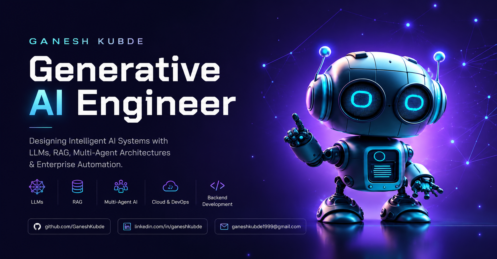

  

<h1 align="center">
Hi, I'm Ganesh Kubde 👋
</h1>

<h3 align="center">
AI Engineer • Agentic AI • Multi-Agent Systems • LangGraph • Azure OpenAI
</h3>

Building production-grade AI systems that transform enterprise workflows through
LLMs, Agentic AI, RAG, and intelligent automation.

---
